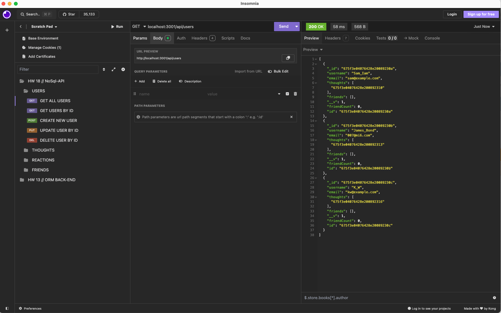
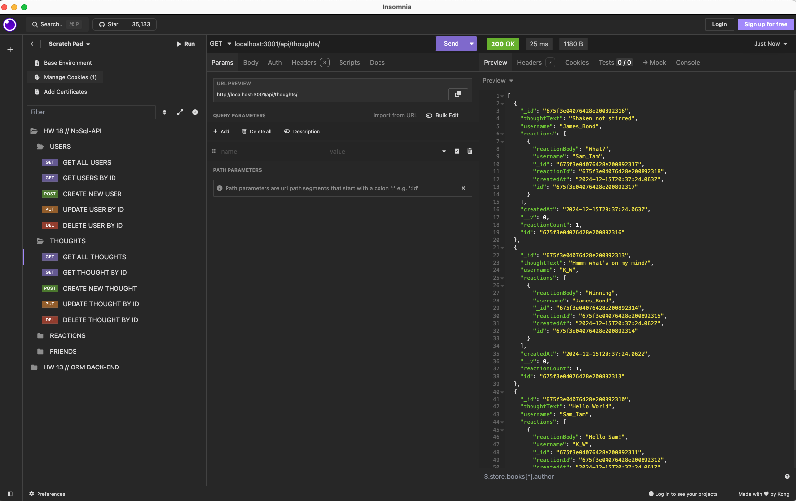
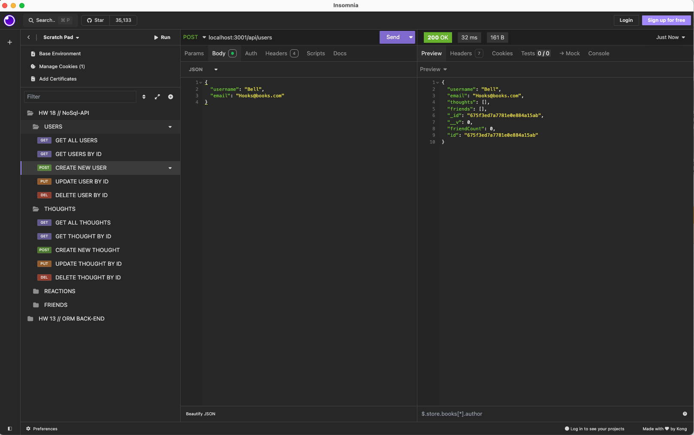

# NoSQL-API 

## Description

An API for a social network app using a NoSql database.

## Mock Up

GET route for retreiving all users from the database.

GET route for retreiving all thoughts from a user within the databast.

POST route for creating a new user and saving into the database.

## Link to DEMO
Click this [link]() to watch a walkthrough video of app functionality.

## Installation
1. Clone the repository to your local computer us the SSH key. 
2. Have Insomnia installed for route testing.

## Usage
2. Navigate to the project folder and install necessary dependencies: `npm install`.
3. Afterwards run seed data using the command `node seed.js`.
4. From there, start the server using the command `npm start`.

## Questions

If you have any questions, please contact me at [wansom.kun@gmail.com](mailto:wansom.kun@gmail.com).
You can also find my projects at [GitHub - kwansom](https://github.com/kwansom).